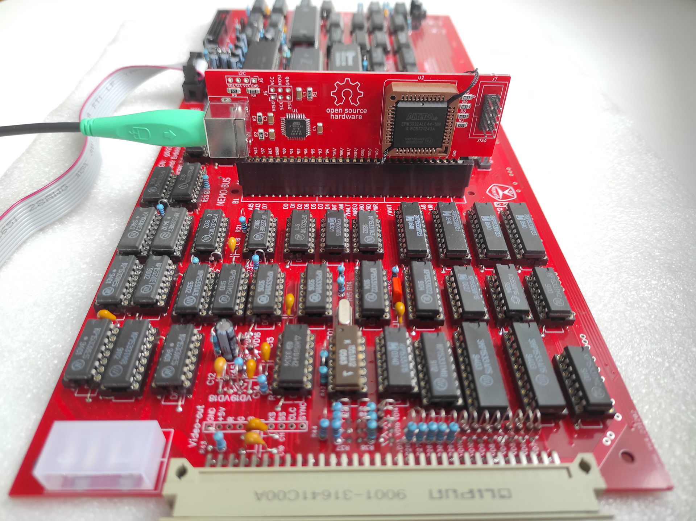
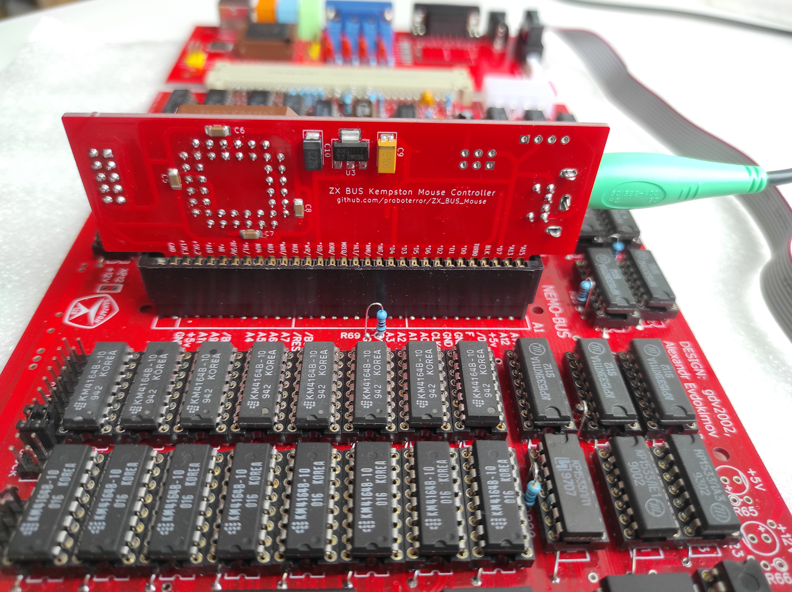
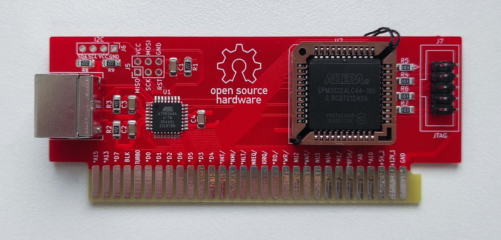
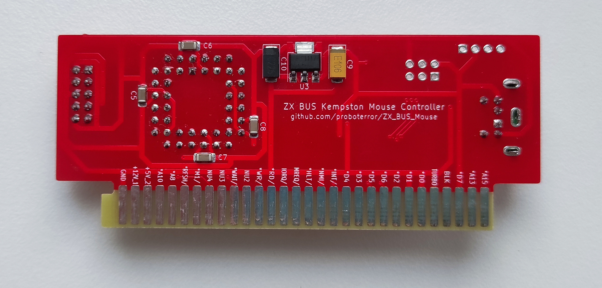
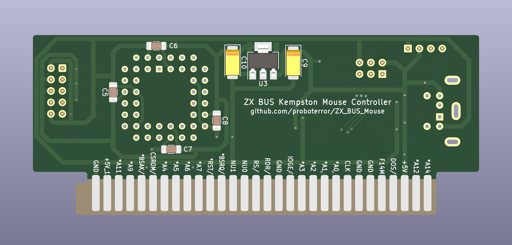
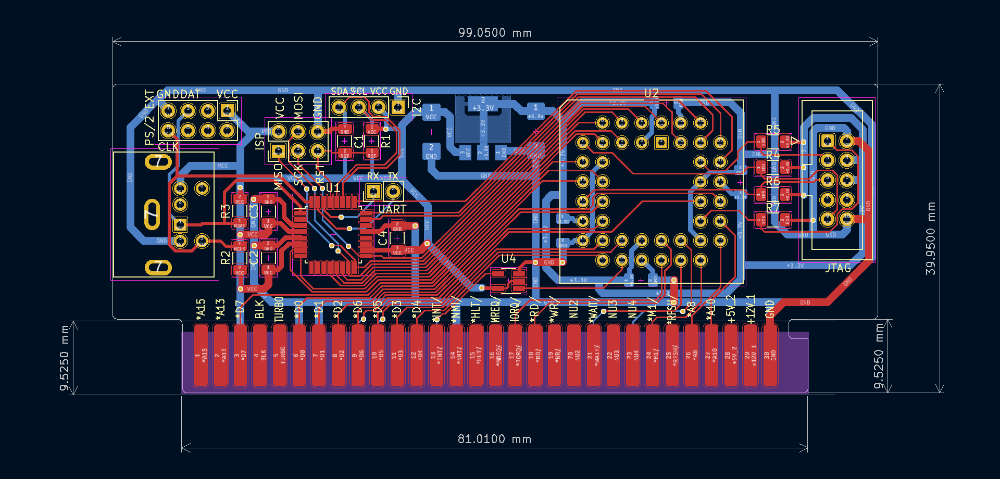
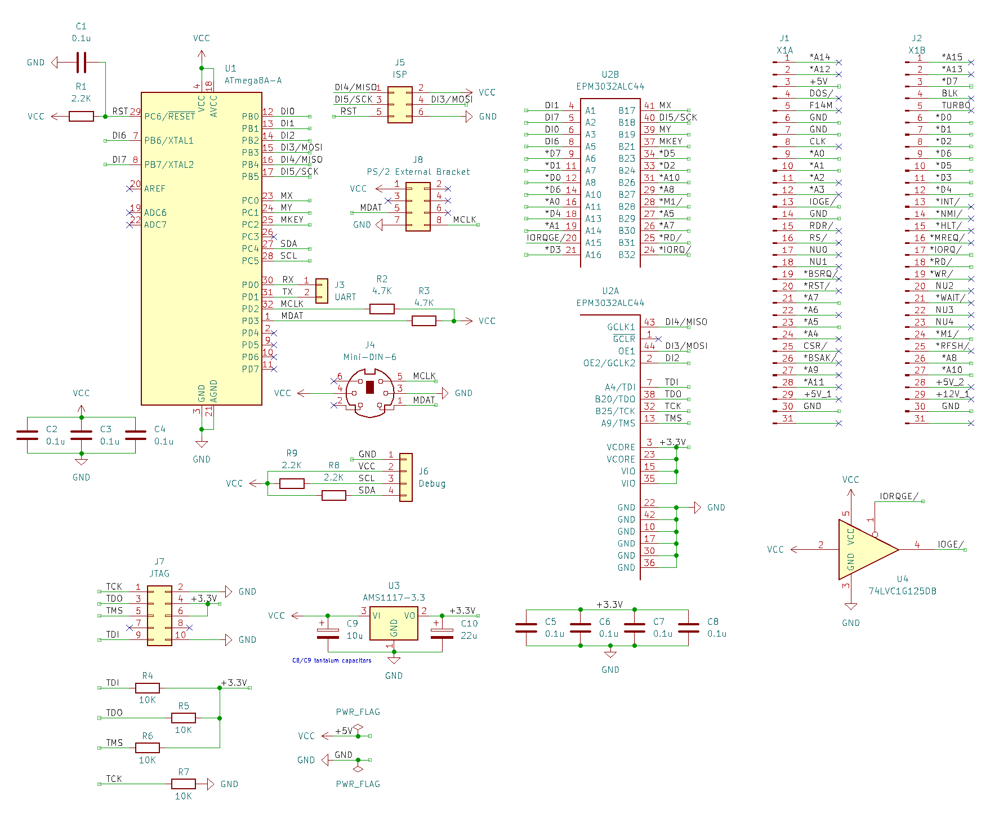
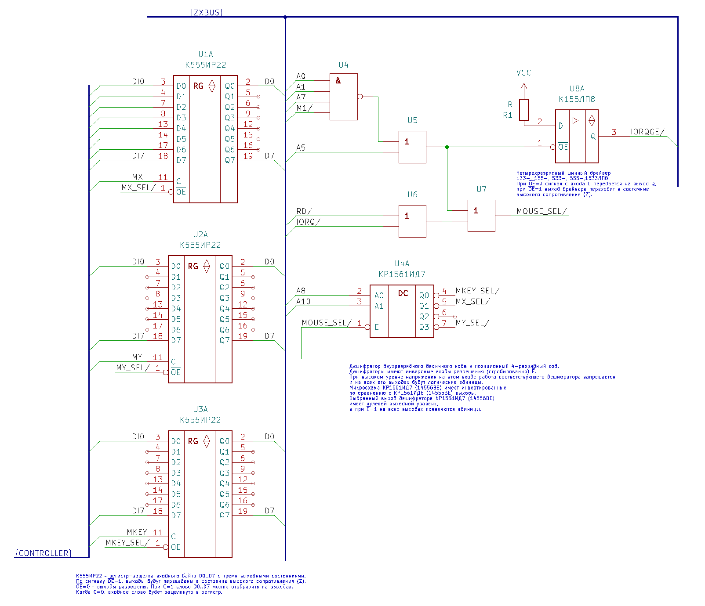

# ZX-BUS PS/2 Kempston Mouse Controller










## История версий
**Version_1.0**
* Сигнал IORQGE/ имеет уровень 3.3V (LVTTL). Плата не работает корректно в ZX-BUS XTRaiser.
* Для включения поддержки колеса мыши нужна CPLD EPM3064.
* При включении регистры контроллера MX, MY, MKEY инициализируются некорректно в 0xFF, 0x80, 0x60: должно быть 0x80, 0x60, 0xFF (в регистре MKEY кнопки должны быть отжаты).

**Текущая версия:**
* Сигнал IORQGE/ буферизирован через 3-state buffer 74LVC1G125 до уровня TTL (5V) для исправления конфликта с ZX-BUS XTRaiser (не проверено) и предупреждения обратного тока с других карт через IO выход CPLD. Решение подсмотрено в схемах в ZX-Multisound и ZXM-GeneralSound.
* Добавлен разъем для подключения внешнего брекета PS/2 (распространенная распиновка PC AT 486/Pentium материнских плат)
* Добавлен разъем UART для отладки
* Ширина краевого разъема ZX-BUS увеличена с 80 до 81 мм
* Описание схемы в CPLD переписано на Verilog и оптимизировано для поддержки колеса мыши на EPM3032 при отказе от третьей кнопки мыши (32 macrocells). Возможна сборка без поддержки колеса мыши (31 macrocells) и с полной поддержкой (34 macrocells).

## Входные требования:
* Разработать максимально компактный простой в повторении интерфейс PS/2 Kempston Mouse для шины ZX BUS.
* Исходники прошивок микроконтролллеров / CPLD, схема и разводка платы должны быть полностью открыты.
* Сигнал WAIT микропроцессора не должен использоваться.

Не входит в требования:
* Поддержка USB мыши. Объем аппаратной и программной поддержки USB стека в микроконтроллере не соответствует сложности задачи.

## Описание интерфейса Kempston Mouse
Контроллер доступен как 3 8-разрядных регистра кнопок и осей X/Y MKEY, MX, MY по следующим адресам портов:
<pre>
#FADF 1111 1010 1101 1111 BUTTONS
#FBDF 1111 1011 1101 1111 MX
#FFDF 1111 1111 1101 1111 MY
</pre>

* Биты 0-2 регистра MKEY соответствуют инвертированным значениям левой, правой, средней кнопок мыши.<br>
* Бит 3 регистра MKEY зарезервирован под четвертую кнопку мыши и всегда равен 1.<br>
* Биты 4-7 регистра MKEY хранят значение оси mouse wheel, если она поддержана (начальное значение %0000). Если ось mouse wheel не поддержана, всегда содержат %1111.

При переполнении 8-bit значений координат осей происходит перенос значения.

Спецификация оси mouse wheel была публично зафиксирована в [сообщении в Fido эхоконференции REAL SPECCY](https://groups.google.com/g/fido7.real.speccy/c/Qeid4aFhjRg)

Дополнительная информация: [https://speccy.info/Kempston_Mouse](https://speccy.info/Kempston_Mouse)

## Некоторые исторические реализации и публикации
[Original Kempston Mouse Interface (1986)](https://k1.spdns.de/Vintage/Sinclair/82/Peripherals/Mouse%20Interfaces/Kempston%20Mouse%20Interface/)

[ZX-Ревю 1995 #1](history/zx-review_1995-01.txt)
[[схема]](history/zx-review_1995-01.png)<br>
KEMPSTON-MOUSE<br>
(С) М.Свечков (схема), К.Мехедов (программа) 1995

Фирма Scorpion & Д.К. (Санкт-Петербург 1995-97)<br>
[Контроллер IBM PC-клавиатуры и мыши](https://web.archive.org/web/20010308054936/http://scorpion.ru/spectrum/hard/kontroller_IBM.htm)<br>
[Схема](history/scorpion_keyboard_mouse_controller_scheme.png) [Прошивка V2.5](history/scorpion_keyboard_mouse_controller_2.5_firmware.zip)<br>
Инструкция по работе и подключению: V2.1: [1](history/scorpion_keyboard_mouse_controller_2.1_1.png) [2](history/scorpion_keyboard_mouse_controller_2.1_2.png) 
V2.5: [1](history/scorpion_keyboard_mouse_controller_2.5_1.jpg) [2](history/scorpion_keyboard_mouse_controller_2.5_2.jpg)<br>
Публикации:
[ZX Format #01 (31 октября 1995)](https://zxpress.ru/article.php?id=319)
[On-Line #15 (17 декабря 1995)](https://zxpress.ru/article.php?id=1989)
[On-Line #16 (24 декабря 1995)](https://zxpress.ru/article.php?id=1994)

[Схема от Михаила Кондратьева (17 апреля 1995)](history/kempmous.txt)

Интерфейс Kempston Mouse от Create Soft (Максим Романов, Mad Max & RML) (Санкт-Петербург)<br>
[ZX-Format #5 (12 декабря 1996)](https://zxdn.narod.ru/hardware/zf5kempm.htm)
[[screenshot]](history/zx-format_5.png)<br>
Схемa KEMPSTON MOUSE<br>
(С) Mad Max

[Spectrofon #20 (12 октября 1996)](https://zxpress.ru/article.php?id=4708)
[[text]](history/spectrofon_20.txt)
[[screenshot]](history/spectrofon_20.png)
[[схема]](history/spectrofon_20_kempston_mouse.png)<br>
ZX-SPECTRUM и МЫШЬ<br>
(C) Владимиp Лаpьков, 1996, Санкт-Петербург

AY Mouse<br>
[ZX Power #1 (12.10.1996)](https://zxdn.narod.ru/hardware/zpw1ayms.htm)<br>
В ЗАЩИТУ БЕДНОЙ МЫШКИ<br>
(C) V.M.G., Харьков

[Optron #13 (12 июня 1998)](https://zxdn.narod.ru/hardware/op13kemp.htm)
[[screenshot]](history/optron_13.png)<br>
Kempston mouse<br>
(C) Рашпиль, Сергей Филимонов

[ZX Club #09 (31 октября 1998)](https://zxpress.ru/article.php?id=14937)
[[screenshot]](history/zx-club_9.png)<br>
Kempston mouse<br>
(С) SERGIUS PUZZLER / PROXIMA

[Adventurer #11 (31 июля 2000)](https://zxdn.narod.ru/hardware/ad11kmse.htm)
[[screenshot]](history/adventurer_11.png)<br>
Описание на подключение Kempston MOUSE (простая и маленькая схема)<br>
(C) Паршуков XN0ByS Юрий/CPU

[Deja Vu #0A (30 сентября 2000)](https://zxdn.narod.ru/hardware/dv0akemp.htm)
[[text]](https://zxpress.ru/article.php?id=11221)
[[screenshot]](history/dejavu_0a.png)<br>
Схема Kempston Mouse Interface (v2.1) на БИС KP580BB55A<br>
(C) Felix Knajzev

Поддержка оси mouse wheel<br>
[DonNews #19 (26 февраля 2003)](https://zxpress.ru/article.php?id=6538)
[[screenshot]](history/donnews_19.png)<br>
KEMPSTON MOUSE INTERFACE<br>
(C) Bit/XXL

[Схема контроллера мыши на AT89C2051 (MSC-51)](history/kmsps2.txt)<br>
Опубликовано в ZX-Net эхоконференции HARDWARE.ZX (21 Aug 2000)<br>
(C) Eugene Stahov 1999-2000<br>
Микроконтроллер AT89C1051/AT89C2051, исходный код прошивки закрыт.<br>
Использует сигнал WAIT при опросе регистров интерфейса.

[PS/2 -> Kempston Mouse Adapter v2.0](history/atmelps2.txt)<br>
Опубликовано в Fido эхоконференции ZX.SPECTRUM (2003-01-10)<br>
(C) 1999-2000 Studio STALL (Eugene Stahov)<br>
(C) 2003 Kamil Karimov<br>
Микроконтроллер AT90S2313 (или AT90S1200), исходный код прошивки закрыт.<br>
Использует сигнал WAIT при опросе регистров интерфейса.

[PS/2 -> Kempston Mouse Adapter v4.0](history/zxkmv40.zip)
[[схема]](history/zxkm4.png)<br>
(C)2010 Kamil Karimov<br>
Не использует сигнал WAIT.<br>
Для обеспечения работы контроллера без торможения Z80 микроконтроллер ATTiny2313 работает на частоте 20 Мгц.<br>
Исходный код прошивки микроконтроллера закрыт.

The Kempston Mouse Turbo Interface [2006/2008](https://velesoft.speccy.cz/kmturbo-cz.htm)/[2011](https://velesoft.speccy.cz/kmouse/km-doc/kempston_mouse_turbo_interface/km-t_2011/k-mouse2011-doc.pdf) by Velesoft and Ben Versteeg<br>
[PC Mouse and Kempston joystick Interface for the Sinclair ZX Spectrum](https://www.benophetinternet.nl/hobby/kmt/)<br>
Поддержка master/slave mouse, mouse wheel.<br>
Микроконтроллер PIC16F84A + CPLD XC9572X<br>
Исходный код прошивки микроконтроллера закрыт.

[Z-Controller](http://pentagon.nedopc.com/info.htm)<br>
(C) Алексей Жабин KingOfEvil 2007<br>
Позволяет подключать к ZX Spectrum стандартную клавиатуру и мышь с интерфейсом PS/2, IDE-устройства, карты флеш-памяти стандарта SD. Устройство предназначено для установки в слот ZX Bus.<br>
[Документация](http://svn.zxevo.ru/filedetails.php?repname=pentevo&path=/docs/ZC.pdf)<br>
Микроконтроллер КР1878ВЕ1 + CPLD EPM7128SLC84<br>
[Исходный код прошивок CPLD и микроконтроллера открыт в 2024 году](https://github.com/koe1234/Z-controller)

[ZX Evolution](http://www.nedopc.com/zxevo/zxevo.php)<br>
(C) NedoPC 2010<br>
Периферийный контроллер ATMEGA128<br>
PS/2 интерфейс клавиатуры и мыши<br>
[Open source](http://svn.zxevo.ru/listing.php?repname=pentevo)

[ZX_Multi_Card ZXMC1/ZXMC2](https://zx-pk.ru/threads/609-zx_multi_card.html)<br>
(C) caro Kamil Karimov 2005<br>
Поддерживает:<br>
- IBM AT клавиатуру - эмулирует стандартную клавиатуру Спектрума;<br>
- PS/2 мышка - эмулирует Кемпстон мышку (с колесом);<br>
- RS232 - поддержка внешнего модема с адресацией по Кондратьеву.<br>
- Часы реального времени (RTC)

Closed source

[Схема контроллера Kempston Mouse для Nemo-BUS](https://zxbyte.ru/kempston_mouse_for_zx.htm) (модификация схемы из Spectrofon #20)<br>
(C) Prusak 2016

[Контроллер для USB клавиатуры и мыши](https://zx-pk.ru/threads/34912-kontroller-dlya-usb-klaviatury-i-myshi.html)
[[github]](https://github.com/Igor-azx987sa/ZXKM)<br>
(С) Игорь Матвеев @azx987sa 2023<br>
Микроконтроллер CH9350<br>
Closed source

## Детали реализации:
Для реализации была выбрана связка ATmega8 + EPM3032.<br>
Общая идея контроллера Kempston Mouse на ATmega+EPM3032, [схема включения и выбор битов адреса для дешифрации портов](images/deltagon_1.5_mouse_controller.png) были взяты из [Deltagon 1.5](https://t.me/Pentagon_ZX_Chat/126403) (C) Евгений Королёв @djking26, Игорь Матвеев @azx987sa.

Прошивка ATmega для обработки протокола написана на языке C. В отдельной ветке есть упрощенная прошивка на библиотеках Arduino.<br>
Аппаратные прерывания ATmega по фронтам сигналов PS/2 MDATA/MCLK и таймеры не использовались для большей понятности кода. Тем не менее, сигналы MDATA/MCLK подключены к входам INT1/INT0 микроконтроллера, есть [альтернативная прошивка](https://github.com/proboterror/ZX_BUS_Mouse/tree/interrupt_processing), использующая аппаратное прерывание от сигнала PS/2 clock. Альтернативная прошивка предназначена в первую очередь для разработчиков.

Реализация регистров интерфейса, схемы дешифрации адресов и формирования сигнала IORQGE для CPLD EPM3032 выполнена на языке Verilog. Также есть признанная менее понятной реализация на VHDL.

Текущая реализация использует 31 из 32 macrocells в CPLD EPM3032 c отключенными битами оси mouse wheel в регистре кнопок мыши, 33 macrocells при включении битов оси mouse wheel.<br>
Теретически возможно использование менее доступной и более дорогой CPLD EPM3064 или оптимизация модели в Verilog и распределения ресурсов в CPLD.<br>
По умолчанию включена поддержка двух кнопок и mouse wheel, используется 32 macrocells.

При подаче питания на контроллер до прихода первого пакета событий от PS/2 мыши в регистры MKEY, MX, MY всегда записываются значения 0xFF, 0x80, 0x60.<br>
При отключенной поддержке оси mouse wheel в старших 4 битах регистра MKEY %1111, при включенной поддержке начальное значение оси %0000.

Формирование сигнала IORQGE/ происходит исходя из общих битов адресов портов A0,A1,A7,A5/ и сигнала M1/.

Отладка устройства проводилась на [Pentagon 2024](https://t.me/Pentagon_ZX_Chat/125656) и сверялась с эмулятором Unreal Speccy 0.39.0, выбранным как референс реализации.
Работа на других клонах ZX Spectrum не проверялась.

Условная эквивалентная схема контролллера в CPLD:


## Известные проблемы:
На Scorpion ZS 256 в меню сервисного монитора мышь работает некорректно, при этом тест, загруженный в RAM, работает корректно. Симптоматически исправлялось включением сигнала A15 в схему дешифрации, аргументированного объяснения этому пока нет. Вариант с использованием сигнала /DOS не проверялся.

Была замечена некорректная работа регистров осей в CPLD: выглядело как перепутанная пара битов. Решилось перекомпиляцией описания схемы и прошивкой CPLD.

На некоторых платах с неправильной реализацией IORQGE теоретически возможен конфликт с портом Kempston Joystick.

## Сомнительно:
PS/2 мышь может требовать задержку перед инициализацией после подачи питания. Решено перезагрузкой контроллера после 2 секунд ожидания инициализации устройства PS/2.

Gluk Reset Service проверяет наличие мыши сразу после включения.<br>
Проверки:<br>
- В цикле неясной длительности проверяется, что значение оси X не меняется
- Проверяется, что регистр KEY не равен регистру X
- Проверяется, что младшие 3 бита регистра KEY равны 1
Проблема:<br>
Мышь при включении автоматически не определяется, но определяется после сброса. Можно принудительно включить мышь через клавишу [8].<br>
Суть проблемы в том, что микроконтроллер ATmega не успевает проинициализировать PS/2 мышь (1-2 s) и выставить значения регистров контроллера по умолчанию (~6 us).<br>

Варианты решения:<br>
- Для определения наличия подсоединенной к контроллеру мыши требуется до 1-2 секунд, в течении которых сигнал /RESET Z80 удерживается контроллером, как это например сделано в контроллере ZXMC.
- Инициализировать регистры контроллера сразу после включения, не дожидаясь проверки наличия PS/2 мыши. Все еще требует внешней задержки сигнала /RESET Z80 более 6 us. Для ПО подобного Gluk тест наличия мыши будет проходить, даже если PS/2 мышь не присоединена.

В коде реализован второй вариант.

## Bill of materials
|Ref|Qnty|Value|Cmp name|Footprint|Description|
|-----|-----|-----|-----|-----|-----|
|C1, C2, C3, C4, C5, C6, C7, C8|8|0.1u|C|Capacitor_SMD:C_1206_3216Metric|Unpolarized capacitor|
|C9|1|10u|C_Polarized|Capacitor_Tantalum_SMD:CP_EIA-6032-28_Kemet-C_Pad2.25x2.35mm|Polarized capacitor|
|C10|1|22u|C_Polarized|Capacitor_Tantalum_SMD:CP_EIA-6032-28_Kemet-C_Pad2.25x2.35mm|Polarized capacitor|
|J4|1|Mini-DIN-6|Mini-DIN-6|Connector_Mini-DIN_Female_6Pin_2rows|6-pin Mini-DIN connector|
|J5|1|Conn_02x03_Odd_Even ISP|Conn_02x03_Odd_Even|Connector_PinHeader_2x03_P2.54mm_Vertical||
|J7|1|Conn_02x05_Odd_Even JTAG|Conn_02x05_Odd_Even|Connector_IDC-Header_2x05_P2.54mm_Vertical||
|R1|1|2.2K|R|Resistor_SMD:R_1206_3216Metric|Resistor|
|R2, R3|2|4.7K|R|Resistor_SMD:R_1206_3216Metric|Resistor|
|R4, R5, R6, R7|4|10K|R|Resistor_SMD:R_1206_3216Metric|Resistor|
|U1|1|ATmega8A-U|ATmega8A-U|Package_QFP:TQFP-32_7x7mm_P0.8mm|16MHz, 8kB Flash, 1kB SRAM, 512B EEPROM, TQFP-32|
|U2|1|EPM3032ALC44|EPM3032ALC44|Package_LCC:PLCC-44_THT-Socket|CPLD MAX3000A MCs:32 IOs:34 [PLCC-44]|
|U3|1|AMS1117-3.3|AMS1117-3.3|Package_TO_SOT_SMD:SOT-223-3_TabPin2|1A Low Dropout regulator, positive, 3.3V fixed output, SOT-223|
|U4|1|74LVC1G125DB|74LVC1G125|Package_TO_SOT_SMD:SOT-23-5|Single Buffer Gate Tri-State, Low-Voltage CMOS|

IC Socket PLCC-44 THT DIP

Разъем J4 PS/2 зеленый с прямыми ушками.<br>
Разъемы программаторов J5, J7 - любой pin header 2x03, 2x05 2.54mm. Запаивать их не обязательно.<br>
Конденсаторы C9, C10 линейного преобразователя напряжения танталовые согласно [datasheet](http://www.advanced-monolithic.com/pdf/ds1117.pdf).

Отладочные компоненты:
|Ref|Qnty|Value|Cmp name|Footprint|Description|
|-----|-----|-----|-----|-----|-----|
|R8, R9|2|2.2K|R|Resistor_SMD:R_1206_3216Metric|Resistor|
|J6|1|Conn_01x04 Debug|Conn_01x04|Connector_PinHeader_1x04_P2.54mm_Vertical||

## Сборка прошивок

### ATmega8
Нужно установить AVR SDK: WinAVR-20100110<br>
Сompile:
<pre>
make clean
make all
</pre>

[Собранная прошивка](source/ATmega/main.hex) с включенной поддержкой mouse wheel и отключенным отладочным выводом на OLED дисплей.

### Altera EPM3032
Для сборки и заливки прошивки CPLD необходима бесплатная версия ПО Quartus II Web Edition версии 9.1 SP2 / 13.0 SP1<br>
Последовательность компиляции и прошивки:<br>
- File/Open Project<br>
- Processing/Start Compilation<br>
- Tools/Programmer<br>
- При необходимости выбрать программатор USB Blaster через Hardware Setup<br>
- Для файла скомпилированной прошивки mouse_controller.pof выбрать Program/Configure и Verify.<br>
- Start.

## Заливка прошивки

### ATmega8
Для прошивки ATmega можно использовать программатор CH341A и ПО NeoProgrammer V2.2.<br>
Последовательность прошивки:<br>
- Убедиться, что микроконтроллер доступен и определяется через SPI: Нажать Detect.<br>
- Если контроллер не определяется, то возможна ошибка соединения проводов с программатором, отсутствие контакта в разъеме ISP, ошибки сборки, в микроконтроллере могут быть прошиты fuses для использования внешнего кварцевого резонатора.<br>
- Выставить Fuses через соответствующий диалог, нажать Write.

[Fuses для прошивки ATmega8:](source/ATmega/fuses.png)
<pre>
Low     High
0xC4    0xD9
</pre>

- Открыть файл .hex прошивки через Open File.<br>
- Через Write IC сделать Erase/Write/Verify.

При некоторой сноровке гребенки разъемов ISP и JTAG можно не припаивать, а прижать под углом на время прошивки.

### Altera EPM3032
Для прошивки по JTAG может быть использован дешевый аналог Altera USB Blaster.<br>
Несколько более дорогие аналоги USB Blaster на FT245+CPLD возможно более совместимы  в установке и работе (не проверялось).

Доступные дешевые аналоги Altera USB Blaster Rev.c на CH552G условно работоспособны, нужно обновление прошивки программатора.<br>
Требуется WCHISPTool и прошивка [CH552_Blaster_v22.2.27.hex](https://github.com/xjtuecho/CH552Nano/blob/main/FW/CH552_Blaster_v22.2.27.hex)<br>
Подробнее: [Прошивка китайского USB-Blaster на основе CH552G](https://ua3reo.ru/proshivka-kitajskogo-usb-blaster-na-osnove-ch552g/)<br>
Драйвер программатора устанавливается из папки установки quartus/drivers/usb-blaster

После запайки в плату всех компонентов помимо CPLD и обвязки JTAG, в первую очередь преобразователя питания 5V=>3.3V, при подаче питания 3.3V на разъем JTAG с программатора напряжение питания падает до ~2V.<br>
CPLD определяется в Quartus, но не прошивается.<br>
Нужно подать на плату внешнее питание 5V через разъем ISP или слот ZX-BUS.<br>
На практике при отладке плата успешно перешивалась на лету на включенном Pentagon 2024.<br>
Требуется особая осторожность при подключении программаторов через USB, необходимо выполнять на выключенном устройстве.

Бывшие в употреблении чипы EPM3032 могут быть залочены и не видны через JTAG интерфейс. Можно [попытать удачи в процедуре unlock](https://zx-pk.ru/threads/25998-programmator-mikroskhem-programmiruemoj-logiki(cpld).html?p=1043136&viewfull=1#post1043136), или заказать у другого поставщика.

### Поддержка mouse wheel
Поддержка mouse wheel в регистре кнопок контроллера включена по умолчанию с отключенной третьей кнопкой мыши. Эта реализация использует 32 macrocells и помещается в EPM3032 (source/Altera-VHDL/mouse_controller.v):
```
	// Example 2 buttons mouse support with mouse wheel (32 macrocells)
	// Exclude 3rd mouse button and reserved bit from output in order to fit to EPM3032.
	assign D = MKEY_SEL ? {register_key[7:4], 2'b11, register_key[1:0]} : 8'hZ;
```
Для поддержки третьей кнопки мыши без колеса прокрутки заменить на:
```
	// Example 3 buttons mouse support with mouse wheel turned off (31 macrocells)
	assign D = MKEY_SEL ? {4'b1111, register_key[3:0]} : 8'hZ;
```
Для полной поддержки заменить на:
```
	// Example 3 buttons mouse support with mouse wheel (34 macrocells)
	assign D = MKEY_SEL ? register_key : 8'hZ;
```
Целевым устройством указать EPM3064.

Работа с EPM3064 не тестировалась.

## Отладка
ПО для тестирования интерфейса: [MousTest (C) 2012 Patrik Rak - Raxoft](test/Test%20Mouse.trd.zip)

Для отладки интерфейса PS/2 можно использовать OLED I2C Display 128x32. Должны быть запаяны резисторы подтяжки I2C SDA/SCL R8, R9.<br>
Припаивать дисплей не нужно, достаточно контакта в разъеме I2C под собственным весом дисплея.<br>
В Makefile нужно включить отладочный код и пересобрать с библиотекой [OLED for AVR mikrocontrollers](https://github.com/Sylaina/oled-display):
```c
CFLAGS += -DDEBUG=1
```
Можно отследить шаги инициализации устройства PS/2, тип устройства, обработку осей, кнопок и колеса мыши.

Проверка инициализации и работы PS/2 мыши микроконтроллером ATmega8:<br>
Вариант 1:<br>
- Вставить OLED дисплей 128x132 в разъем I2C.
- Прошить отладочную прошивку [ZX_BUS_Mouse_ATmega8_Fuses_C4_D9_Debug_OLED_128x32.hex](source/ATmega/Debug/ZX_BUS_Mouse_ATmega8_Fuses_C4_D9_Debug_OLED_128x32.hex)

При включении выводится надписи Init... Done и далее при движении мыши ее координаты и состояние оси wheel / кнопок.

Вариант 2:<br>
- Присоединить светодиод к контактам разъема I2C GND и SDA. Короткий пин светодиода к GND.
- Прошить отладочную прошивку [ZX_BUS_Mouse_ATmega8_Fuses_C4_D9_Debug_LED_SDA_GND.hex](source/ATmega/Debug/ZX_BUS_Mouse_ATmega8_Fuses_C4_D9_Debug_LED_SDA_GND.hex)

При включении после успешной инициализации PS/2 мыши светодиод загорается. При нажатии кнопок гаснет.

## Credits
* Общая идея контроллера Kempston Mouse на связке ATmega+EPM3032, схема включения и выбор битов адреса для дешифрации портов: [Deltagon 1.5](https://t.me/Pentagon_ZX_Chat/126403) (C) Евгений Королёв @djking26, Игорь Матвеев @azx987sa 
* @Alex_Eburg - [ZX BUS PCB Prototype Board](https://github.com/AlexEkb4ever/ZX_BUS)
* Black_Cat - [BC Info Guide #7. Стандартизация ZXBus интерфейсов и шин.](https://zx.clan.su/forum/7-82-1) (c) Black_Cat 2011-2020
* Adam Chapweske - PS/2 Mouse/Keyboard Protocol (C) 1999, The PS/2 Mouse Interface (C) 2003
* Kris Chambers - [Arduino/Wiring Library for interfacing with a PS2 mouse](https://github.com/kristopher/PS2-Mouse-Arduino)
* [Patrik Rak raxoft](https://github.com/raxoft) - MousTest
* Sylaina - [OLED for AVR mikrocontrollers](https://github.com/Sylaina/oled-display) library
* Velesoft - [RUSKA VERZE KEMPSTON MOUSE](https://velesoft.speccy.cz/kmrus-cz.htm) - скриншоты статей из электронных журналов
* Zxdn - [Электроника/схемы устройств - Клавиатуры, мыши](https://zxdn.narod.ru/hardware.htm#inputdev)
* Калинин Вячеслав/newart - [zxpress.ru](https://zxpress.ru)
* @AMM - поддержка в начальном запуске
* @Michael_Kaa - помощь в тестировании на Scorpion ZS 256
* @djking26 - локализация проблемы с Gluk Reset Service